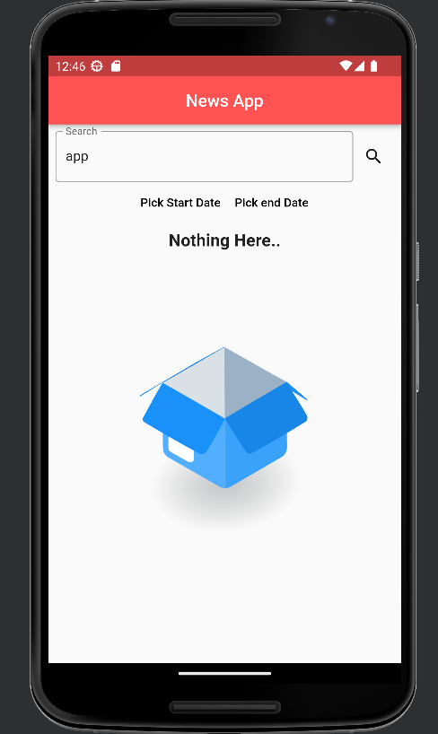

  

 
<i>A News App using <a href="https://flutter.dev/">Flutter 💕</a></i>
  

## About the App 📰

- News is a App to view the popular breaking news 🤤!

- You can filter the search between dates 😍.

- You can search by keywords 🤗.

## Screens 😍

  

## In Action 👀

  

